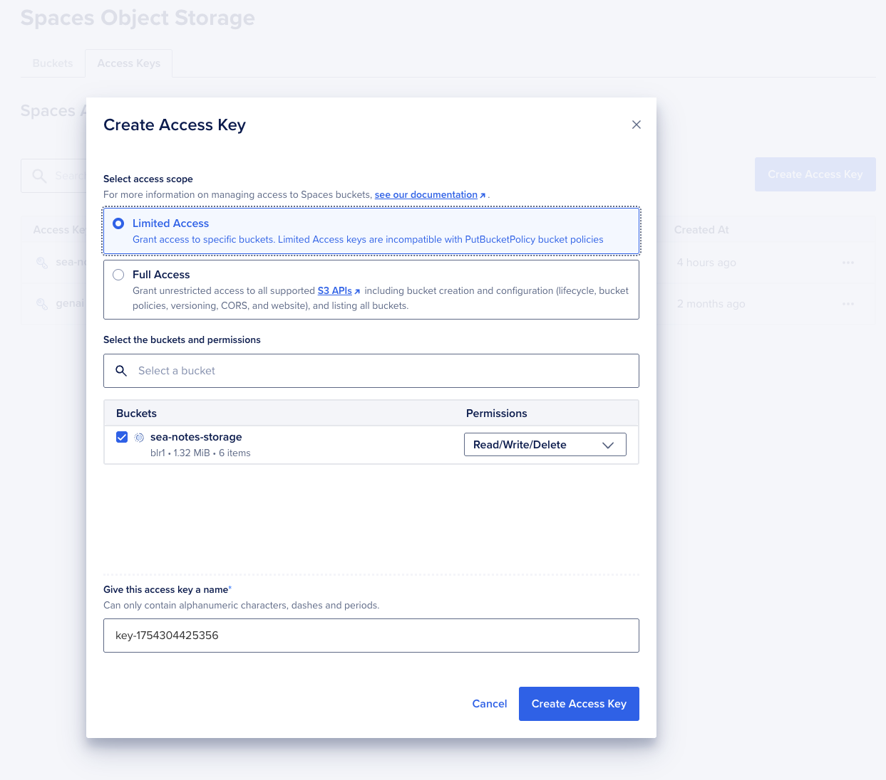

# DigitalOcean Spaces Storage Setup

This guide will help you configure DigitalOcean Spaces storage for the invoice generation feature.

## Prerequisites

1. A DigitalOcean account.

## Step 1: Create a Spaces Bucket

1. Log in to your [DigitalOcean dashboard](https://cloud.digitalocean.com/)
2. Navigate to **Spaces Object Storage**
3. Click **Create a Spaces Bucket**
4. Configure the bucket:
   - **Choose a region**: `blr1` (Bangalore)
   - **Choose a name**: `sea-notes-storage`
5. Click **Create a Spaces Bucket**

## Step 2: Generate Access Keys

1. From the **Spaces Object Storage** section, go to `Access Key` and then click on `Create Access Key`.

2. Select the bucket, the access type, give it a name and click on **Create Access Key**

3. Copy the **Key ID** and **Secret Key** (you won't be able to see the secret again)

## Step 3: Configure Environment Variables

Add these variables to your `.env` file:

```bash
# ====================
# FILE STORAGE (DigitalOcean Spaces)
# ====================
STORAGE_PROVIDER=Spaces

# Spaces credentials (from your DigitalOcean dashboard)
SPACES_KEY_ID=your-access-key-id-here
SPACES_SECRET_KEY=your-access-key-secret-here

# Spaces configuration
SPACES_REGION=blr1
SPACES_BUCKET_NAME=sea-notes-storage
```

## Step 4: Verify Configuration

1. Restart your development server:
   ```bash
   npm run dev
   ```

2. Check the system status page at `/system-status` to verify:
   - Storage (DigitalOcean Spaces) shows as "Connected"
   - No configuration errors are displayed

## Step 5: Test Invoice Generation

1. Navigate to `/dashboard/subscription`
2. Click the "Download Invoice" button
3. Verify that:
   - The invoice is generated successfully
   - The PDF downloads automatically
   - No errors are displayed

## Storage Structure

Files will be stored in the following structure:
```
sea-notes-storage/
├── invoices/
│   ├── user-id-1/
│   │   ├── INV-20241201-1234.pdf
│   │   └── INV-20241201-5678.pdf
│   └── user-id-2/
│       └── INV-20241201-9999.pdf
└── uploads/ (for other file uploads)
    └── user-id-1/
        └── profile-picture.jpg
```

## Security Features

- **Private ACL**: All files are stored with private access
- **Signed URLs**: Download links expire after 1 hour
- **User Isolation**: Each user's files are in their own folder
- **Invoice Validation**: Only valid invoice numbers can be accessed

## Troubleshooting

### Common Issues

1. **"Storage service not configured"**
   - Check that all environment variables are set correctly
   - Verify the access key and secret are valid
   - Ensure the bucket name matches exactly

2. **"Storage service not connected"**
   - Check your internet connection
   - Verify the region is correct (`blr1`)
   - Ensure the bucket exists and is accessible

3. **"Invoice not found or access denied"**
   - Verify the user has generated an invoice
   - Check that the invoice number format is valid
   - Ensure the user owns the invoice

### Debug Steps

1. Check the system status page for detailed error messages
2. Verify environment variables are loaded correctly
3. Test the storage connection manually
4. Check browser console for frontend errors
5. Check server logs for backend errors

## Production Deployment

For production deployment:

1. **Environment Variables**: Set all storage variables in your production environment
2. **Bucket Permissions**: Ensure the bucket has the correct permissions
3. **CORS Configuration**: Configure CORS if needed for cross-origin requests
4. **Monitoring**: Set up monitoring for storage usage and errors

## Cost Considerations

- **Storage**: Pay only for what you use
- **Bandwidth**: Charges for data transfer
- **Requests**: Minimal cost for API requests
- **Estimated Cost**: Very low for typical SaaS usage

## Support

If you encounter issues:

1. Check the [DigitalOcean Spaces documentation](https://docs.digitalocean.com/products/spaces/)
2. Verify your configuration matches this guide
3. Check the system status page for detailed error information
4. Review the application logs for specific error messages 