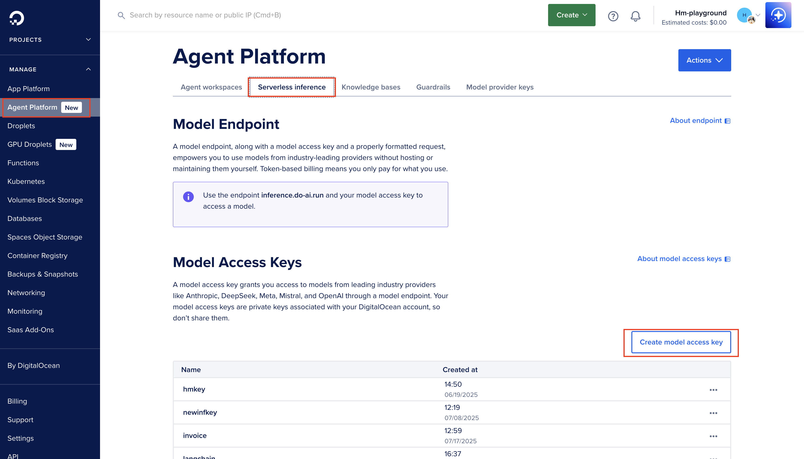

# Invoice Generation Guide

This guide explains how to use **SeaNotes**' AI-powered invoice generation feature, which automatically creates invoices for user subscriptions using DigitalOcean's [GradientAI Serverless Inference API](https://docs.digitalocean.com/products/gradientai-platform/how-to/use-serverless-inference).

## Overview

The invoice generation feature provides:

- **Automatic Invoice Creation**: Generates invoice when users subscribe to plans
- **AI-Powered Design**: Uses DigitalOcean's GradientAI Serverless Inference API to create invoices
- **Email Delivery**: Sends invoices directly to users with PDF attachments
- **Manual Generation**: Allows users to request invoices on-demand from the billing page

## Prerequisites

Before setting up invoice generation, ensure you have:

- [DigitalOcean account](https://cloud.digitalocean.com/registrations/new) for Serverless Inference
- [Stripe setup](./stripe-integration-guide.md) completed for billing
- [Resend setup](../README.md#part-2-set-up-email-provider-resend) completed for email delivery

## Part 1: Set Up DigitalOcean Serverless Inference

The invoice generation feature uses DigitalOcean's [GradientAI Serverless Inference API](https://docs.digitalocean.com/products/gradientai-platform/how-to/use-serverless-inference/) to create professional, AI-generated invoices. Since the system emails invoices to users, you'll need Resend configured for email delivery.

### Step 1: Access DigitalOcean Agent Platform

1. **Log in to DigitalOcean**:
   - Go to [DigitalOcean Control Panel](https://cloud.digitalocean.com/)
   - Sign in with your account credentials

2. **Navigate to Agent Platform**:
   - In the left sidebar, click on **Agent Platform**
   - Click on **Serverless Inference**
   - Create Access Key**:
      - Click the **"Create model access key"** button
      - Give your key a descriptive name (e.g., "seanotes-invoice-generation")
      
      - Click **Save** to generate the key
      - **Important**: Copy the generated key immediately - you won't be able to see it again

### Step 2: Configure Environment Variables

1. **Update Your `.env` File**:
   
   Add the following environment variable to your `.env` file:

   ```bash
   # Invoice Generation (DigitalOcean GradientAI Serverless Inference)
   INVOICE_PROVIDER=DigitalOcean GradientAI
   DO_INFERENCE_API_KEY=your-digitalocean-inference-api-key-here
   ```

   Replace `your-digitalocean-inference-api-key-here` with the key you copied in Step 2.

2. **For Production Deployment**:
   
   If you're deploying to DigitalOcean App Platform, add these variables to your app spec:

   ```yaml
   envs:
     - key: "INVOICE_PROVIDER"
       value: "DigitalOcean GradientAI"
     - key: "DO_INFERENCE_API_KEY"
       value: "${DO_INFERENCE_API_KEY}"
       type: "SECRET"
   ```

### Step 3: Test the Connection

1. **Run the Test Script**:
   
   ```bash
   cd application
   node scripts/generate-invoice.js
   ```

   This script will:
   - Test the connection to the Serverless Inference API
   - Generate a sample invoice
   - Save the results to `scripts/output/` directory

2. **Expected Output**:
   ```
   🔍 Testing connection to DigitalOcean Serverless Inference...
   ✅ Connection successful! Available models:
      - llama3-8b-instruct
      - anthropic-claude-3-opus
      - anthropic-claude-3-sonnet
   
   📄 Generating invoice for: John Doe
   📋 Plan: Pro Plan
   💰 Amount: $12.00
   📅 Invoice #: INV-20241201-1234
   
   🤖 Generating invoice with Serverless Inference API...
   ✅ Received response from serverless inference
   ✅ Invoice generated successfully!
   📧 Subject: Invoice #INV-20241201-1234 - Pro Plan Subscription
   
   💾 Invoice saved to:
      HTML: scripts/output/invoice-2024-12-01T12-34-56-789Z.html
      Text: scripts/output/invoice-2024-12-01T12-34-56-789Z.txt
   ```

## Technical Implementation

### API Endpoint

The invoice generation is handled by the `/api/billing/generate-invoice` endpoint:

```typescript
POST /api/billing/generate-invoice
Content-Type: application/json

// Request body (empty for authenticated users)
{}

// Response
{
  "success": true,
  "message": "Invoice generated and sent to user@example.com",
  "invoiceNumber": "INV-20241201-1234",
  "planName": "Pro Plan",
  "amount": 12.00,
  "pdfAttached": true
}
```

### Service Architecture

The invoice generation uses a layered service architecture:

1. **InvoiceService**: Main service using the Serverless Inference API
2. **PDFService**: Converts HTML invoices to PDF attachments
3. **EmailService**: Sends invoices with attachments
4. **BillingService**: Provides subscription and plan data

### AI Prompt Engineering

The system uses carefully crafted prompts for consistent invoice generation:

```typescript
const prompt = `Generate a professional invoice for the following subscription:

Customer Information:
- Name: ${invoiceData.customerName}
- Email: ${invoiceData.customerEmail}

Plan Details:
- Plan Name: ${invoiceData.planName}
- Description: ${invoiceData.planDescription}
- Amount: $${invoiceData.amount}
- Billing Interval: ${invoiceData.interval || 'one-time'}
- Features: ${invoiceData.features.join(', ')}

Invoice Details:
- Invoice Number: ${invoiceData.invoiceNumber}
- Invoice Date: ${invoiceData.invoiceDate.toLocaleDateString()}
- Subscription ID: ${invoiceData.subscriptionId}

Please create a professional invoice with:
1. Company header with "SeaNotes" branding
2. Customer and invoice details clearly displayed
3. Itemized breakdown of the subscription
4. Professional styling with blue color scheme (#0061EB)
5. Mobile-responsive design
6. Clear call-to-action for payment or support

Return the response as a JSON object with html, text, and subject fields.`;
```

### Fallback System

If the AI service is unavailable, the system gracefully falls back to:

1. **Template-Based Generation**: Uses built-in HTML templates
2. **Basic Styling**: Professional but simplified design
3. **Core Functionality**: All essential invoice information
4. **Error Handling**: Clear error messages to users


## Troubleshooting

### Connection Errors

**Problem**: "Invoice service not configured or connected"

**Solutions**:
1. Verify `DO_INFERENCE_API_KEY` is set correctly
2. Check DigitalOcean Agent Platform access
3. Ensure the key has proper permissions
4. Test connection with the script: `node scripts/generate-invoice.js`

### AI Generation Failures

**Problem**: "Failed to generate invoice"

**Solutions**:
1. Check AI service status in DigitalOcean dashboard
2. Verify model availability (`llama3-8b-instruct`)
3. Review API rate limits
4. Check network connectivity

### Email Delivery Issues

**Problem**: Invoice generated but not received

**Solutions**:
1. Verify Resend configuration
2. Check spam/junk folders
3. Ensure email service is enabled (`ENABLE_EMAIL_INTEGRATION=true`)
4. Review email service logs


